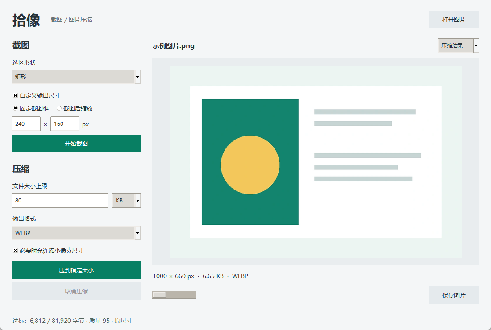

# 拾像：截图与图片压缩

Windows 本地桌面小工具。图片不上传服务器，无账号、无后端。



## 下载

在 [Releases](https://github.com/Romizzzz/shixiang/releases/latest) 下载 `Shixiang.exe`，
双击运行，无需安装 Python。当前提供 Windows x64 版本。

此版本未进行代码签名。遇到系统安全提示时，请先核实下载来源与发布页的 SHA-256，
不要关闭系统防护。

## 运行

从源代码运行需要 Windows 10/11、Python 3.9+（带 Tkinter）。

```powershell
python -m pip install -r requirements.txt
python app.py
```

也可双击 `start.bat`。如果 Python 不在 PATH，请用其完整路径运行。

## 截图

- 选择矩形、正方形、圆形或椭圆。
- 点击开始截图后，主窗口隐藏；自由选区模式按住鼠标左键拖动，松开完成。
- 右键或 Esc 取消并返回主窗口。
- 勾选自定义输出尺寸后，可选择两种模式，圆形和正方形都要求宽高相同：
  - **固定截图框**：先生成指定宽高（屏幕物理像素）的选区，按住框内拖动定位。
    松开鼠标不会截图；点击“确认截图”或按 Enter 完成。方向键微调 1 px，Shift + 方向键移动 10 px。
    不缩放、不挤压；边缘移动保持尺寸，超出虚拟桌面宽高的尺寸会报错。
  - **截图后缩放**：自由拖选，松开后重采样为指定输出宽高；非等比例设置可能拉伸图像。
- 两种模式都在开始截图时冻结桌面画面，固定框移动期间不会更新视频等动态内容。
- 圆形、椭圆以透明背景 PNG 保存，也可以接着压缩为 WebP。
- 多屏按 Windows 虚拟桌面坐标处理；混合 DPI 显示器仍需真实硬件验证。

## 压缩

打开静态图片或使用刚完成的截图，指定 KB / MB 上限后压缩。
1 KB = 1024 字节，1 MB = 1024 KB。

- JPEG / WebP 在质量 20–95 区间搜索达标结果。
- PNG 保留无损编码；允许缩小尺寸时可能减少像素，不保证原分辨率达标。
- 不允许缩小且无法达标时，会提示失败，不伪造达标状态。
- JPEG 不支持透明，转换前会要求确认白色背景。
- 预览下拉菜单切换原图 / 压缩结果，保存当前选中的版本。
- 结果显示实际字节数、尺寸与压缩质量；支持取消。
- 为防止异常文件耗尽内存，导入最多 4000 万像素；自定义截图最多 2000 万像素。
- 不支持动画、HDR 色彩管理、滚动截图；受保护画面可能无法截图。
- 不保留 EXIF 等原始元数据；导入时自动校正 EXIF 方向。

## 测试

```powershell
python -m unittest discover -s tests -v
```

## 可选：打包 EXE

```powershell
python -m pip install pyinstaller
python -m PyInstaller --noconfirm --onefile --windowed --name Shixiang app.py
```

产物在 `dist/Shixiang.exe`。打包前建议在目标 Windows 机器验证截图和多屏。

## 项目结构

- `app.py`：桌面界面、屏幕选区和后台任务。
- `image_ops.py`：裁切、形状蒙版和目标体积压缩。
- `tests/`：核心行为回归测试。

## 验证范围

核心测试及 Windows 桌面流程测试覆盖隐藏窗口、选区裁切、自定义输出像素、
固定框移动及逐像素保真、右键取消和压缩。混合 DPI 多屏场景尚未实机验证。
